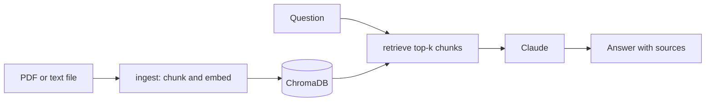

# Document Q&A


A RAG (Retrieval-Augmented Generation) pipeline that lets you upload documents and ask questions about them. Documents are chunked, embedded using a sentence transformer, and stored in ChromaDB. Questions are answered by Claude after retrieving the most relevant chunks.

Retrieval is measured rather than assumed: a golden set checks recall@k and CI fails if it drops. See [Retrieval Evaluation](#retrieval-evaluation).

## How it works



## Tech Stack

| Layer | Technology |
|---|---|
| Language | Python 3.11 |
| LLM | Claude (Anthropic API) |
| Embeddings | sentence-transformers/all-MiniLM-L6-v2 |
| Vector Store | ChromaDB |
| Orchestration | LangChain |
| API | FastAPI + Uvicorn |
| Containerization | Docker |
| CI/CD | GitHub Actions |
| Testing | Pytest |

## Quick Start

**Install dependencies**

```bash
pip install -r requirements.txt
```

**Set your API key**

```bash
export ANTHROPIC_API_KEY=your_key_here
```

**Ingest documents**

```bash
python -m src.ingest data/docs/my_document.pdf
python -m src.ingest data/docs/   # ingest a whole directory
```

**Serve the API**

```bash
uvicorn src.serve:app --reload
```

**Run with Docker**

```bash
docker build -t document-qa .
docker run -p 8000:8000 -e ANTHROPIC_API_KEY=your_key document-qa
```

The image is also published to GHCR on every push to `main`, so you can skip the build:

```bash
docker run -p 8000:8000 -e ANTHROPIC_API_KEY=your_key ghcr.io/yigitliman/document-qa:latest
```

## API Endpoints

| Method | Endpoint | Description |
|---|---|---|
| GET | `/health` | Readiness probe |
| POST | `/ingest` | Upload a PDF or text file |
| POST | `/ask` | Ask a question |

**Upload a document:**

```bash
curl -X POST http://localhost:8000/ingest \
  -F "file=@report.pdf"
```

**Ask a question:**

```bash
curl -X POST http://localhost:8000/ask \
  -H "Content-Type: application/json" \
  -d '{"question": "What are the main findings of this report?"}'
```

```json
{
  "answer": "The report identifies three main findings...",
  "sources": ["report.pdf"]
}
```

## Retrieval Evaluation

Generation quality is only as good as the chunks it's grounded in, so retrieval is evaluated on its own: a small multi-topic golden set (`tests/fixtures/`) checks whether the chunk that actually answers each question is among the top-k the retriever returns (recall@k). It runs against real embeddings, with no `ANTHROPIC_API_KEY` needed, since generation isn't being evaluated, only retrieval.

```bash
python -m src.evaluate_retrieval
```

Currently scores **100% recall@4** on the 6-question golden set. `tests/test_retrieval_eval.py` enforces a minimum of 80% recall@4 in CI, so a change that quietly hurts retrieval (a chunking tweak, a different embedding model) fails the build instead of shipping unnoticed.

What this number is not: the golden set is 6 short paragraphs on very different topics, one question each, which is close to the easiest retrieval task there is. It catches a regression after a chunking or embedding change. It says nothing about a large corpus of overlapping documents, which is where recall@k gets hard.

## Running Tests

Most tests use mocks so no API key is needed; the retrieval evaluation test uses real embeddings but not the LLM.

```bash
pytest tests/ -v
```

## CI/CD

Every push to `main` runs the test suite (mocked, no API key needed), then builds the Docker image and publishes it to GitHub Container Registry.

## License

Released under the MIT License. See [LICENSE](LICENSE).
