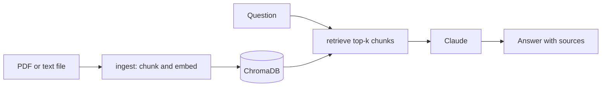

# Document Q&A


A RAG (Retrieval-Augmented Generation) pipeline that lets you upload documents and ask questions about them. Documents are chunked, embedded using a sentence transformer, and stored in ChromaDB. Questions are answered by Claude after retrieving the most relevant chunks.

## How it works



## Tech Stack

| Layer | Technology |
|---|---|
| Language | Python 3.11 |
| LLM | Claude (Anthropic API) |
| Embeddings | sentence-transformers/all-MiniLM-L6-v2 |
| Vector Store | ChromaDB |
| Orchestration | LangChain |
| API | FastAPI + Uvicorn |
| Containerization | Docker |
| CI/CD | GitHub Actions |
| Testing | Pytest |

## Quick Start

**Install dependencies**

```bash
pip install -r requirements.txt
```

**Set your API key**

```bash
export ANTHROPIC_API_KEY=your_key_here
```

**Ingest documents**

```bash
python src/ingest.py data/docs/my_document.pdf
python src/ingest.py data/docs/   # ingest a whole directory
```

**Serve the API**

```bash
uvicorn src.serve:app --reload
```

**Run with Docker**

```bash
docker build -t document-qa .
docker run -p 8000:8000 -e ANTHROPIC_API_KEY=your_key document-qa
```

## API Endpoints

| Method | Endpoint | Description |
|---|---|---|
| GET | `/health` | Readiness probe |
| POST | `/ingest` | Upload a PDF or text file |
| POST | `/ask` | Ask a question |

**Upload a document:**

```bash
curl -X POST http://localhost:8000/ingest \
  -F "file=@report.pdf"
```

**Ask a question:**

```bash
curl -X POST http://localhost:8000/ask \
  -H "Content-Type: application/json" \
  -d '{"question": "What are the main findings of this report?"}'
```

```json
{
  "answer": "The report identifies three main findings...",
  "sources": ["report.pdf"]
}
```

## Running Tests

Tests use mocks so no API key is needed.

```bash
pytest tests/ -v
```

## CI/CD

Every push to `main` runs the test suite (mocked, no API key needed), then builds the Docker image and publishes it to GitHub Container Registry.

## License

Released under the MIT License. See [LICENSE](LICENSE).
